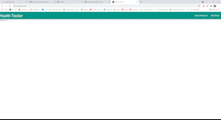

# Health Tracker

## Table of Contents
* [Deployed](#deployed)
* [Description](#description)
* [Technologies](#technologies)
* [Usage](#usage)
* [Preview](#preview)
* [Credits](#credits)

## Deployed
https://sarawrmas.github.io/health-tracker/

## Description
Keep your health on track using our all-in-one health tracker tool to find exercises and recipes. This project is a work in progress that is currently being refigured to use React and React-Materialize! Check back soon for updates, including the ability to login, save search results, and make a holistic plan encompassing both diet and exercise choices.

## Technologies
* React
* CSS
* React-Materialize
* JavaScript
* Jquery

## Usage
We will update this as soon as the page is finished. The aim is to be able to navigate between a Workout search page and a Recipe search page, where you can search using specific criteria and then save results to a workout plan.

Check out the gif preview below to see the local version in action!

## Preview

## Credits
* Sara Adamski - https://github.com/sarawrmas  
* Marcos Badillo - https://github.com/MBadi089  
* Lane Johnson - https://github.com/lanejohnson98  
* Bayleigh Walker - https://github.com/bayleighwalker