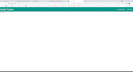

# Health Companion

## Table of Contents
* [Deployed](#deployed)
* [Description](#description)
* [Technologies](#technologies)
* [Usage](#usage)
* [Preview](#preview)
* [Credits](#credits)

## Deployed
Access the application at https://health-companion.herokuapp.com/

## Description
Keep your health on track using our all-in-one health companion to find exercises and recipes. This application began as a simple JavaScript group project, but has blossomed into a full stack application that continues to add features.

Udates coming soon:
* User can access their profile
* Ability to make a schedule comprised of both food and exercise plans
* Addition of another API to find resources for mental health to create a truly holistic health plan

## Technologies
* React
* React-Materialize
* JavaScript
* Express
* Node.js
* MongoDB
* Apollo Server
* Bcrypt
* GraphQL
* JSON Web Token

## Usage
The home page displays a series of photos with captions that one might use when thinking about their health.

To begin, select Menu at the top left navigation to open a list of options.

To login or sign up, select "Login" at the top. This will take you to a page where you can either login to an existing account, or select Signup to create a new one.

After logging in, your full name and email will be displayed at the top of the side navigation, letting you know that your login was successful.

Choose "Search Workouts" from the side navigation to browse through workouts. You can search by target muscle or equipment. Select the appropriate tab, and then make your selection from the dropdown menu and hit the "Find" button. A list of results will display underneath. Click on one to view a modal containing more information about that exercise, including name, a gif demonstration, target, category, and equipment needed.

Choose "Plan Meals" from the side navigation to find a reciple. You can use the Custom Search bar to search recipes by any keyword, or you can select a diet type from the "By Diet" dropdown menu. Just like the exercise search, a list will display with clickable links that open a modal with more information. The recipe result modal also contains a link to the full recipe that will open in a new tab.

For each search tool, 20 results will display per page. Use the pagination at the bottom to get the next 20 results, clicking through until the end.

To logout, select "logout" from the side navigation and you will be logged out of your account and redirected to the home page.

At any time, you may click the "Health Companion" link in the navigation bar to return home.

## Preview

## Credits
* Sara Adamski - https://github.com/sarawrmas  
* Marcos Badillo - https://github.com/MBadi089  
* Lane Johnson - https://github.com/lanejohnson98  
* Bayleigh Walker - https://github.com/bayleighwalker